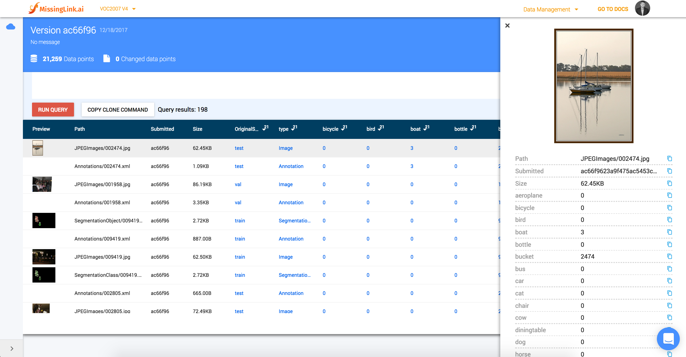

Original Dataset from: http://host.robots.ox.ac.uk/pascal/VOC/voc2007/
Documentation: http://host.robots.ox.ac.uk/pascal/VOC/voc2007/htmldoc/voc.html

Dataset files: http://host.robots.ox.ac.uk/pascal/VOC/voc2007/VOCtrainval_06-Nov-2007.tar and http://host.robots.ox.ac.uk/pascal/VOC/voc2007/VOCtest_06-Nov-2007.tar 

http://academictorrents.com/details/c9db37df1eb2e549220dc19f70f60f7786d067d4

### Download the dataset

Run `./download_data.sh` - it will download the dataset (train, val and test) and place them under the data folder

### Run the script to generate metadata

`./create_dataset.py ./data`

### Clean the data folder
Before uploading the metadata we need to remove some unneeded 
`rm -rf ./data/ImageSets`

### Install Manually

1. Create a new virtualenv
2. run `pip install -r requirements.txt`
3. download the dataset into 'data' folder. the dataset includes to zipped files - one for trainval and one for test. 
Merge the two extracted folders. 
You should have 5 folders under data: 
    * 'Annotations' 
    * 'ImageSets' 
    * 'JPEGImages' 
    * 'SegmentationClass' 
    * 'SegmentationObject'
4. run `python create_dataset.py ./data` - this will produce a metadata.json file.

### Upload the data files
Now that the metadata.json was produced you can safely remove the `ImageSets` folder. 
we will not upload the metadata files.

`rm -rf data/ImageSets`

Upload the data files:

`mali data add [VOLUME ID] --files ./data`

### Upload metadata:

`mali data metadata add [VOLUME ID] -df metadata.json`

### Commit the version
`mali data commmit [VOLUME ID] -m [Message]`

